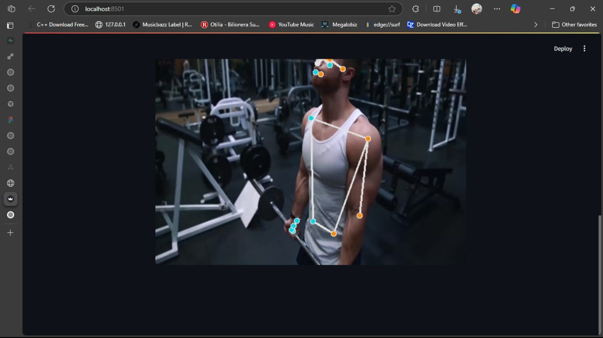

# 🏋️ Exercise Pose Detection App

A deep learning-powered web application that classifies workout exercise poses from images. Built with [Streamlit](https://streamlit.io/), [TensorFlow](https://www.tensorflow.org/), and [MediaPipe](https://mediapipe.dev/), this app detects human pose keypoints and predicts the exercise being performed using a trained neural network.

---



## 🚀 Features

- **Easy-to-use Web Interface:** Upload an image and get instant exercise pose classification.
- **Pose Detection:** Utilizes MediaPipe for robust human pose keypoint extraction.
- **Deep Learning Model:** Classifies workout poses using a neural network trained on a diverse dataset.
- **Visualization:** Displays detected keypoints and pose skeleton on the input image.
- **Fast & Accurate:** Real-time predictions with high accuracy.

---

## 🛠️ Tech Stack

- Python
- Streamlit
- TensorFlow / Keras
- MediaPipe
- OpenCV
- scikit-learn

---

## 📦 Dataset

- [Workout/Exercise Images (Kaggle)](https://www.kaggle.com/datasets/hasyimabdillah/workoutexercises-images)

---

## ⚡ Getting Started

1. **Clone the repository**
    ```sh
    git clone https://github.com/crazyscriptright/Exercise_pose_detection.git
    cd Exercise_pose_detection
    ```

2. **Install dependencies**
    ```sh
    pip install -r requirements.txt
    ```

3. **Run the app**
    ```sh
    streamlit run app.py
    ```

4. **Upload an image** and see the predicted exercise pose!

---

## 📷 Example


---

## 📁 Project Structure

```
.
├── app.py
├── excercise.h5
├── label_encoder.pkl
├── requirements.txt
├── README.md
├── .github/
│   └── image.jpg
└── ...
```

---

## 🤝 Contributing

Contributions are welcome! Please open an issue or submit a pull request.

---

## 📜 License

This project is licensed under the MIT License.

---

## 🙌 Acknowledgements

- [MediaPipe](https://mediapipe.dev/)
- [TensorFlow](https://www.tensorflow.org/)
- [Kaggle Dataset](https://www.kaggle.com/datasets/hasyimabdillah/workoutexercises-images)

---

> **Made with ❤️ for fitness and AI!**